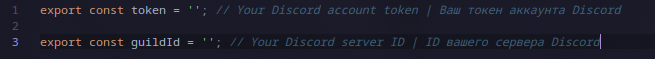

# Система авто-принятия заявок в гильдию на ваш Discord сервер [RU]
Данный дискорд скрипт написан на [TypeScript](https://www.typescriptlang.org/) с использованием библиотеки [playwright v1.53.1](https://www.npmjs.com/package/playwright) для управления вашим браузером.

> ## Пример

> ## Запуск
- **Пукнт 1**: Подготовка
    - - `bun install` в терминал
    - - Заполнить конфиг в `src/config.ts`:
    - - Токен вашего аккаунта в Discord и ID вашей гильдий
    

- **Пункт 2**: Запуск Скрипта
    - - Запустите скрипт с помощью команды `npm start` или `bun run src/index.ts`

## В конце я хочу же Вас попросить поставить ⭐ на этот репозиторий

---

## Auto-Accept System for Guild Requests on Your Discord Server [EN]

This Discord script is written in [TypeScript](https://www.typescriptlang.org/) using the [playwright v1.53.1](https://www.npmjs.com/package/playwright) library to control your browser.

> ## Example  

> ## Usage  
- **Step 1**: Setup  
    - - Run `bun install` in your terminal  
    - - Fill in the config in `src/config.ts`:  
    - - Your Discord account token and your guild ID  
      

- **Step 2**: Run the script  
    - - Execute `npm start` or `bun run src/index.ts`

## Finally, please consider giving ⭐ to this repository  